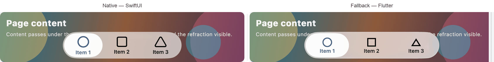
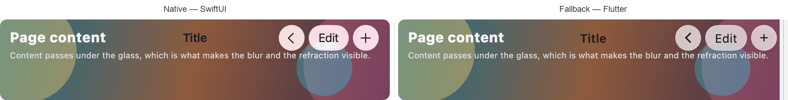
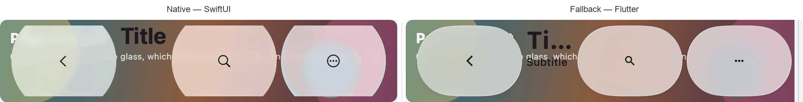

# swiftui_kit

Glass bars for Flutter that are drawn by SwiftUI where SwiftUI is available and
painted in Flutter everywhere else.

The package provides two floating surfaces:

- `GlassCapsuleBar` — a capsule bar intended for the bottom of a page.
- `GlassTitleBar` — a title bar intended for the top of a page.

On iOS and macOS both are drawn by SwiftUI inside platform views, so the glass is
the system's own: `.glassEffect` on iOS 26 and macOS 26 and later, and a blur with
a rim below that. On every other platform they are painted by the package itself.

Both renderers consume the same spec — the same geometry, colours and callbacks,
pushed down to the native side and read directly by the Flutter one. Switching
renderers therefore does not move or recolour the glass, and both report the same
events.

## The two renderers

Each pair below is one widget, one spec, one moment: the native renderer on the
left and the Flutter fallback on the right, over the same content.

`GlassCapsuleBar`, three items with the middle one selected:



`GlassTitleBar`, an inline title with a leading item and a trailing one:



`GlassTitleBar` with a large title and a subtitle:



These are captures of the example gallery on macOS in light mode, not renders, so
what they show is what the two renderers actually draw. `example/` can reproduce
any of them; see [Comparing the two renderers](#comparing-the-two-renderers).

The differences that remain are the ones a second implementation cannot avoid: the
native glass refracts more of the content underneath, while the fallback is a
single flat tone that does not follow its backing. On plain backgrounds the two
agree closely; over a photograph the fallback reads brighter. See
[Limitations](#limitations).

## Platform support

| Platform | Renderer | Minimum |
| --- | --- | --- |
| iOS | SwiftUI platform view | iOS 15 |
| macOS | SwiftUI platform view | macOS 12 |
| Android, web, Windows, Linux | Flutter | — |

The system liquid glass itself needs iOS 26 or macOS 26; below that the native
renderer draws a blur with a rim, which is what the system does for the same
controls.

## Getting started

Add the package to your `pubspec.yaml`:

```yaml
dependencies:
  swiftui_kit:
    path: ../swiftui_kit
```

Then import it:

```dart
import 'package:swiftui_kit/swiftui_kit.dart';
```

## Usage

### Title bar

```dart
GlassTitleBar(
  title: 'Title',
  searching: _searching,
  onSearchCancel: () => setState(() => _searching = false),
  items: <GlassTitleElement>[
    const GlassTitleItem(
      placement: GlassTitlePlacement.topBarLeading,
      label: 'Leading',
      icon: GlassIcon(systemName: 'number', fallback: Icons.tag),
    ),
    GlassTitleItem(
      icon: const GlassIcon(
        systemName: 'magnifyingglass',
        fallback: Icons.search,
      ),
      onPressed: () => setState(() => _searching = true),
    ),
  ],
)
```

### Capsule bar

```dart
GlassCapsuleBar(
  items: const <GlassCapsuleItem>[
    GlassCapsuleItem(
      label: 'Item 1',
      icon: GlassIcon(systemName: 'house.fill', fallback: Icons.home),
    ),
    GlassCapsuleItem(
      label: 'Item 2',
      icon: GlassIcon(systemName: 'checklist', fallback: Icons.checklist),
    ),
  ],
  selectedIndex: _tab,
  onItemTap: (int index) => setState(() => _tab = index),
  searchEnabled: true,
  searching: _searching,
  onSearchEnter: () => setState(() => _searching = true),
  onSearchCancel: () => setState(() => _searching = false),
  onSearchChanged: (String text) => debugPrint(text),
)
```

Neither bar reserves space for itself. Put it in a `Stack` to float it over
content, or in a `Column` to give it a row of its own.

## Widgets

### `GlassCapsuleBar`

A floating capsule bar with an optional trailing action and an optional search
field. The bar is two separate capsules: the left one holds `items` and draws a
grey plate under the selected item, the right one holds `trailing` or, when
`searchEnabled` is set, a magnifier. When there is nothing on the right, the left
capsule is centred.

The plate is a fill rather than another piece of glass: the system's selection
material is not exposed to third-party code, and its own appearance follows its
backdrop, so a re-implementation can only sit within the range the system shows.
Its colour is not a parameter — a light neutral grey is derived from the
brightness (black at 7% in light, white at 8% in dark) and travels in the palette
alongside the ink. The system's plate also shades from lighter at the top to
darker at the bottom; this one is flat.

| Parameter | Description |
| --- | --- |
| `items` | The items of the left capsule. Each is a `label` with an optional `icon`. |
| `selectedIndex` / `onItemTap` | The selected item and the tap callback. The index refers to `items`. |
| `searchEnabled` | Whether the right end shows a magnifier. |
| `searching` | Whether search is active. Owned by the caller; see below. |
| `searchText` | The text being edited. When omitted the bar keeps its own controller. |
| `searchPrompt` | Placeholder of the search field. Defaults to `Search`. |
| `searchCancelLabel` | Label of the cancel action. Defaults to `Cancel`. |
| `onSearchEnter` / `onSearchChanged` / `onSearchSubmitted` / `onSearchCancel` | Search callbacks. |
| `trailing` / `onTrailingTap` | The right capsule, and its tap callback. |
| `item.help` | A tooltip shown on hover, on macOS. |
| `spacing` / `height` | The gap between the two capsules, and their height. |
| `visualWeight` / `allowsHitTesting` | Visual weight from 0 to 1, and whether the bar accepts input. |

Search state is owned by the caller, in the same way as for `GlassTitleBar`:
activating the magnifier reports `onSearchEnter` and the caller sets `searching`
to true, at which point the left capsule widens into a search field and the right
one collapses. Tapping cancel reports `onSearchCancel`, and the caller clears it.

### `GlassTitleBar`

A floating title bar. One item is one piece of glass; the title is text floating
over the page and carries no glass of its own. The layout follows SwiftUI's
toolbar.

| Parameter | Description |
| --- | --- |
| `title` / `subtitle` | The title (centred when inline, large and leading-aligned otherwise), and a line of detail shown only alongside a large title. |
| `displayMode` | `GlassTitleDisplayMode.inline` or `.large`. |
| `largeTitleColor` | The colour of a large title. |
| `items` | The items, distributed by their `placement`. A `GlassTitleItem` is one item; a `GlassTitleGroup` is several sharing one piece of glass. |
| `searching` | Whether search is active. Owned by the caller; see below. |
| `searchText` | The text being edited. When omitted the bar keeps its own controller. |
| `searchPrompt` / `searchCancelLabel` | The search field placeholder and the cancel label. |
| `onSearchChanged` / `onSearchSubmitted` / `onSearchCancel` | Search callbacks. |
| `height` / `spacing` | The size of one item, and the gap between items that are not in the same group. |
| `visualWeight` / `allowsHitTesting` | As above. |

Search is entered by the caller: put the magnifier in `items`, set `searching` to
true from its `onPressed`, and clear it from `onSearchCancel`. While searching,
the centre becomes a text field and the trailing end becomes a cancel action.

There is no dedicated back button. It is simply a leading item, written like any
other.

A `GlassTitleItem` can be an icon, a label, or both. An icon alone makes a
circular item; a label makes one that extends to the width of its text. It also
carries `help`, `badge` (a dot in the top-right corner), `selected`, and `tint`
(the fill used while selected, defaulting to the theme's primary colour). An item
without `onPressed` cannot be pressed, which is useful for read-only displays.

`GlassTitleGroup` is several items sharing one piece of glass, equivalent to
SwiftUI's `ToolbarItemGroup`: only the outside is an edge, and the members are
separated by the group's own `gap`. Ungrouped adjacent items are separated by
`spacing` instead.

An item can only contain a label and an icon. The glass of one renderer is drawn
by the system and of the other by this package, so an arbitrary widget cannot
cross to the native side. Put such widgets on the page itself.

Event indices refer to the **flattened** list, with groups expanded, which is how
the native side numbers them too.

### `GlassIcon`

The two renderers do not accept the same kind of icon: the native one draws the
glyphs itself and therefore only accepts an SF Symbol name, while the fallback
uses Flutter's `IconData`. A `GlassIcon` carries one of each — `systemName` and
`fallback`.

Supply both to get the same icon from either renderer. Supplying only one leaves
the other renderer with the label alone.

## Choosing a renderer

`GlassRendererScope` overrides the renderer for the subtree it wraps. The override
is placed on an enclosing widget rather than on each bar, because which renderer
a page uses is a page-level decision.

```dart
GlassRendererScope(
  renderer: GlassRenderer.fallback,
  child: GlassCapsuleBar(items: items),
)
```

| Value | Description |
| --- | --- |
| `auto` | The default, also used when there is no enclosing scope. Uses the native renderer where it is available and the fallback elsewhere. |
| `native` | Always uses the native renderer, and asserts if the platform has none. |
| `fallback` | Always paints the glass in Flutter. |

`hasNativeRenderer` reports whether the current platform has the native renderer:
true on iOS and macOS, false elsewhere, including web, which has no platform
views.

## Native contract

The two sides agree on a small set of names and one message shape. See
[doc/native-contract.md](doc/native-contract.md) for the view types, the method
channel, the spec keys, the event envelope and the palette.

## Padding and heights

The fallback applies its own padding, because it also handles the safe area. The
native renderer is a bare rectangle, so the Dart side pads the platform view to
the same numbers. The two must agree, or switching renderers moves the glass.

| Widget | Padding | Content height |
| --- | --- | --- |
| `GlassCapsuleBar` | 16 at the sides, 14 above, and below either 20 with a safe area or 8 without | `height` |
| `GlassTitleBar` | 16 at the sides, 8 above and below | `height`, or for a large title `max(height, subtitle line 18 + title line 34)` |

## Example

The example is a gallery: one case per row, and inside each row the two renderers
side by side with the same spec at the same moment, each next to the code that
produces it. Selecting a case on the left drives both.

```bash
cd example
flutter run -d macos      # or -d ios
```

See [example/README.md](example/README.md) for the pages, the cases, and the
capture tooling used to compare the two renderers.

## Development

### Tests

```bash
flutter analyze
flutter test
```

The Dart tests intercept `SystemChannels.platform_views` and the per-surface
channels, so they cover how a spec is pushed, how events reach callbacks, and how
much padding is applied, without a real native side.

The Swift half has to be compiled to be checked:

```bash
cd example
flutter build macos --debug
# or
flutter build ios --simulator --no-codesign
```

### Comparing the two renderers

The fallback follows the system: when macOS, iOS or the system itself is updated,
the Flutter painters in `lib/src/fallback/` are brought back in line with the
native glass. What you compare is the two columns the gallery renders side by
side, from one screenshot:

```bash
cd example
dart run tool/capture.dart --start          # add --no-build on later runs
dart run tool/capture.dart --pages Capsule --item 0 --crop canvas
dart run tool/capture.dart --stop
```

`crop=canvas` keeps only the two canvases, native on the left and Flutter on the
right, which is the image to compare; `crop=item` also includes the code below
them. The same page, case, crop and appearance always lands on the same file
name, so a new run replaces the old one instead of accumulating.

The left column is drawn by the system. Capturing it goes through a platform
channel (`MainFlutterWindow.swift` in the example) that asks the system to
compose the whole window into one image, because the native glass is not in
Flutter's own layer tree. Only the macOS side of the example implements that
channel; when it is missing, `--start` says so and `/health` reports
`window: false`.

When comparing, these are the places the two diverge:

| What | Where the difference shows |
| --- | --- |
| Thickness and edge of the glass | How wide the refracted band is, and whether the rim has its lit line |
| Body tone | How far apart the two columns measure over the same backing |
| Type | Weight and size of the title and the item labels, and the gap between an icon and its label |
| Selection | Colour, corner radius, and how far the plate extends past the content box |
| Padding | Distance to the edges and the height of an item |

The body tone is measured, not eyeballed: take the median of one row in each
column, avoiding the selection plate in the middle, and act when the two differ
by more than 5 levels. The current approximation — 0.88 white over `#FAFAFA` in
light mode, 0.66 `#202020` in dark — is fitted to native readings of 255, 227, 20
and 139 on four backings (white, light grey, dark, and a photograph).

Measurements only mean anything on a fully drawn frame. The system renders a whole
window later than Dart does, so right after a page change, an appearance change or
a scroll the window may still hold the previous frame. The capture tooling waits
500 ms by default (`--settle`); use `--burst` to sample the transition itself.

## Limitations

- Only iOS and macOS register the two platform views. Every other platform takes
  the fallback under `auto`.
- A platform view on macOS ignores Flutter's `Opacity`, `Transform` and clipping.
  To fade a whole bar, use `visualWeight`, which travels in the spec.
- An item can only contain a label and an icon; see `GlassTitleBar`.
- The native renderer does not animate the selection plate between items; the
  fallback slides it.
- The fallback glass is a single flat tone, so it does not follow its backing.
  Over a photograph it reads about 40 levels brighter than the native glass,
  which lets more of the content through. On white, dark and light grey backings
  the two are within 3 levels.
- The native glass is drawn in the system appearance. The brightness is resolved
  on the Dart side from the caller's theme and applied to the view, so the two
  do not diverge.
- Swift Package Manager is not supported yet; Flutter prints a warning for macOS
  builds. The two platforms compile one copy of the Swift sources, held in
  `shared/swiftui_kit` and reached through symlinks, because CocoaPods refuses
  paths outside the pod root and SwiftPM refuses files outside the target
  directory.

## License

MIT. See [LICENSE](LICENSE).
