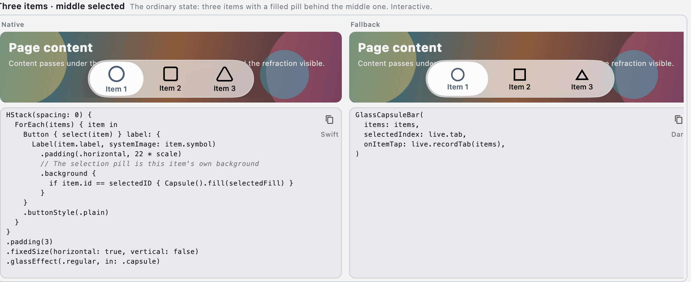

# swiftui_kit_example

The gallery for `swiftui_kit`: every shape of the two glass bars, running and
tappable, with the native renderer and the fallback renderer side by side.

One case, as it appears in the running app — a headline, then the two lanes, each
a canvas with the code that draws it underneath:



The shell is laid out like a macOS app:

```
┌──────────┬──────────────────────────────────────────────────────────┐
│ sidebar  │ toolbar  page name · what it is · appearance · copy page  │
│  Capsule ├──────────────────────────────────────────────────────────┤
│  Title   │ list of cases   one case = a headline + a frame           │
│          │                 the frame holds two lanes: native         │
│          │                 (canvas + Swift) and fallback            │
│          │                 (canvas + Dart), same spec, same moment   │
└──────────┴──────────────────────────────────────────────────────────┘
```

Every case has the same form: a headline (the name, one line about it, and what
was tapped last once something has been), then a frame.

Inside the frame the two renderers sit in two lanes next to each other. Each
lane is a canvas — a backdrop plus the glass drawn by that renderer — with the
code for that shape underneath: on the left the SwiftUI lines behind the native
glass, on the right the Dart lines a caller writes. The two lanes are the same
width, and each sample shares its left edge and its width with the canvas above
it.

Both samples have a copy button that puts those lines on the clipboard and turns
into "Copied" in place. The button at the top right copies the **whole page** as
one image — including the native glass — ready to hand to someone else.

## Running it

```bash
cd example
flutter run -d macos      # or -d ios
```

The dependency points back at the package with a path (`swiftui_kit: path: ../`),
so a change inside the package shows up here immediately.

To open one page only:

```bash
flutter run -d macos --dart-define=only=Capsule
```

On the web, use the query string instead: after `flutter run -d chrome`, open
`?only=Capsule`.

## Pages and cases

| Page | Cases |
| --- | --- |
| Capsule | Three items · middle selected, No selection, Trailing · icon only, Trailing · with label, Search, Receding, Not hittable, Labels only, Icons only, Height 52, Height 74, Five items, On white, On dark, On light grey |
| Title | Inline title, Leading · with label, Principal · custom title, Selected and badge, Large title, Large title over photo, Search, Receding, Not hittable, No title, Spacing and height, On white, On dark, On light grey |

Two things live in the toolbar:

| Control | What it does |
| --- | --- |
| Appearance | Light / dark. Both lanes take their ink from the theme (the brightness is pushed down to the native side too), so both switch together |
| Copy page | Renders the whole window as one image and puts it on the clipboard, through a method channel handled on the macOS side. Flutter's clipboard only takes text, and the native glass is not in Flutter's own canvas, so the system has to render it. The button then shows the result: the pixel size on success, why on failure |

A canvas is only ever 560 wide: wider than 300 because the fallback lane (the
package's own capsule bar) overflows its inner row below 300. When the window is
narrower than the two lanes, the frame scrolls sideways rather than squeezing the
canvases — squeezed canvases are no longer the same spec.

## The capture server

With `--dart-define=capture_port=<port>`, the page also opens a local server
(`lib/capture/capture_server.dart`). The outside asks it for images by page,
case, crop and appearance, and it switches page, switches appearance, scrolls to
the case and captures on its own. `tool/capture.dart` is the CLI that drives it:

```bash
dart run tool/capture.dart --start                     # builds once, then leaves the page in the background
dart run tool/capture.dart --pages Capsule             # the capsule page, one whole-page image
dart run tool/capture.dart --pages Capsule --item 0,3 --crop canvas
dart run tool/capture.dart --pages Capsule,Title --item 0 --appearance dark
dart run tool/capture.dart --stop                      # finish
```

`--start` hands the app over and returns (it wraps it in an `sh` layer that puts
it in the background, so the command does not wait for it) and reports one line
once the server answers; add `--no-build` to skip the build. The app's output
lands in `/tmp/swiftui_kit_capture/app.log`.

The app cannot be a direct child of that command: while it is, `dart run` does
not finish until the child exits, and the app is meant to stay up — `--start`
would never return.

| Route | What comes back |
| --- | --- |
| `GET /health` | Whether it is up, how many pages, whether the window route works |
| `GET /pages` | Page and case names (each case: index, title, hint) |
| `GET /shot?pages=&item=&crop=&appearance=&settle=&burst=` | A small manifest: which images, how large, where the two canvases are, and which route to fetch an image from |
| `GET /file/<id>` | That PNG |
| `GET /quit` | Finish |

- `pages` is a comma-separated list of page names; without it every page is
  captured. `item` is an index within the page (`0,3` or `0-2`) and only applies
  with `crop=item` or `crop=canvas`.
- `crop` has three steps. Without it, naming items means that case's block and
  naming none means the whole page. `item` is that case's block (from the
  headline down to the bottom of the two samples, taken horizontally from the two
  canvases, because a case's row is wider than the two lanes and the whole row
  would add a strip of page background); `canvas` is the two canvases only;
  `page` is the whole page.
- `appearance` is `light` or `dark`; without it, `light`.
- `settle` is how long to wait before capturing, in milliseconds (500 by
  default). The system renders the window later than the Dart side: after a page
  change, an appearance change or a scroll the window still shows the previous
  frame for a moment, and waiting too little captures that frame — which looks
  like the native side changing colour once, when it is really an unfinished
  frame.
- `burst` captures several frames after a single change: give a list of
  milliseconds (such as `0,40,80,160`, at most 12), and each id carries
  `at<ms>`, the real time from that change to the capture. Draw a curve from that
  number, not from the one asked for. One case at a time.
- `trigger` says which change to measure: `appearance` (the default) puts the
  scene on the other appearance step first and then switches; `mount` scrolls the
  case out of view (the list is lazy, so it is disposed) and back in, measuring
  the moment it mounts again. Mounting is another place where the glass "changes
  colour once", and it is hit by scrolling and by large content changes too.
- An id carries the page name, case index, crop and appearance, so asking the
  same question twice overwrites the same image; `/file/<id>` only reads the id
  part, and percent-decodes it.

A whole page is one image stitched at 1× logical points: the list scrolls down
one screen at a time (each screen left to settle), and the bottom is only where
it stops moving; the screens are then stitched at the positions they were
captured at. The total height is not measured first: the list is lazy and its
bottom is estimated from the cases laid out so far, and the estimate keeps
moving.

The server only listens when started with `capture_port`. The window route only
exists on the macOS side; elsewhere `/health` says `window: false`.

## The two lanes

A case's two lanes show the same spec at the same moment: one `Live` (which item
is selected, whether search is open) is given to both, so pressing something on
the left moves the right as well and the two are always comparable.

After the system changes (or on another macOS / iOS release), this is how the
fallback catches up:

1. Run the page and look at the left lane (native).
2. Compare case by case: the thickness and edge of the glass, the weight and size
   of the text, the colour and corner radius of the selection pill, the insets at
   both ends, and how the glass behaves over a bright and a dark backdrop. Read
   the two samples against each other too — a difference also shows how the
   native side is written.
3. Change the package's fallback renderer where it differs: the capsule in
   `lib/src/fallback/fallback_capsule_bar.dart`, the title bar in
   `lib/src/fallback/fallback_title_bar.dart`, the glass itself in
   `lib/src/fallback/liquid_glass_surface.dart`.
4. Run the page again: the two lanes should line up.

Search needs a press in each lane — it only appears once pressed, and the right
lane needs a press on the magnifier.

## Relation to the package

- Every case is built from the package's public API: `GlassCapsuleBar`,
  `GlassTitleBar`, `GlassIcon` and `GlassRenderer`.
- The two lanes are the two renderers: `native` (only where the platform has one,
  which `hasNativeRenderer` reports) and `fallback` (the glass this package
  paints in Flutter). Which one a lane uses is decided by the
  `GlassRendererScope` wrapped around it, so a case never names a renderer.
- The shell (sidebar, toolbar, frame, the two samples) uses Flutter's own
  widgets, not the two bars: this is where the glass is looked at, so it should
  not be glass itself.

## A known rough edge

Switching width (a page change, an appearance change) makes the fallback lane lay
itself out at a narrower width for its **first frame** and settle on the next;
in debug that frame shows the yellow-and-black overflow stripes. That belongs to
the package and the tests filter it out, but the gallery shows it as it is — it
is exactly what the fallback needs fixing.

## Tests

```bash
flutter test
```

The tests run on the test platform (no SwiftUI, and no window capture channel),
so they take the fallback lane. What they pin: that both lanes and both samples
are present in a case and that their edges line up, that pressing a case changes
its state, that the later cases can be scrolled to, what the two copy buttons
hand over, that the appearance switches, that a narrow window does not squeeze
the canvases, and that all three backdrops and every shape lay out without
throwing. The capture server's tests (`test/capture_server_test.dart`) answer the
window route with a fake whole-window image and pin what the server says: which
pages and cases there are, what it returns by default, whether a case's block is
cut correctly, and what it says about a request it does not recognise. Looks are
checked by running the page; the native half has its own tests in the package
(`../test/`), which feed both routes of the platform view.

The test platform owns its own clock, so image encoding (decoding the window,
encoding the stitched page) has to wait inside `WidgetTester.runAsync`;
awaiting it directly waits forever, without an error and without moving on.
